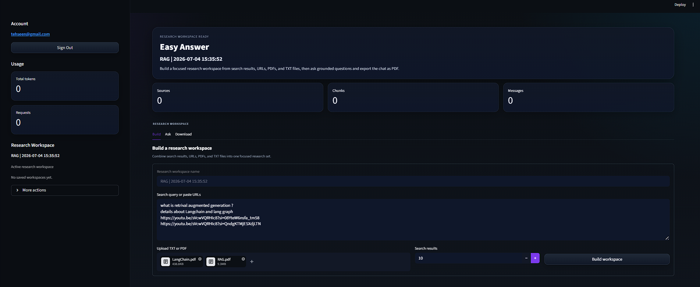
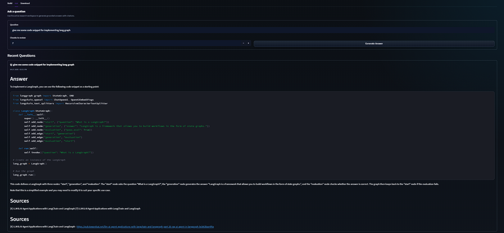
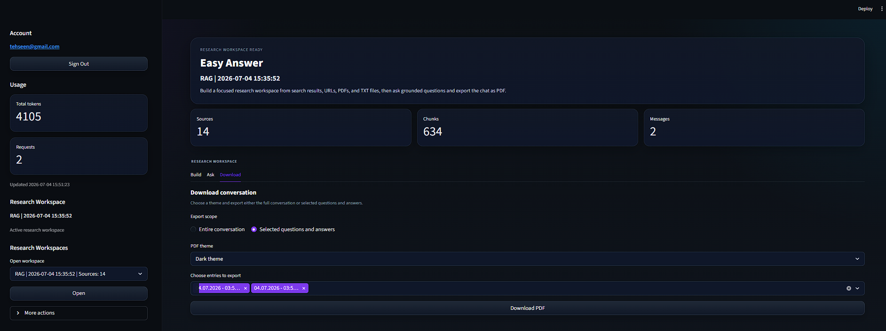

# Easy Answer

<p align="center">
  
  
  
  
  
  
</p>

Easy Answer is a Streamlit-based research assistant built around a practical Retrieval-Augmented Generation (RAG) workflow. It lets a user create research workspaces from search results, URLs, YouTube transcripts, TXT files, and PDFs, store them locally in FAISS, and ask grounded questions with Groq-generated answers and citations.

The app now includes user authentication, per-user workspace isolation, saved Groq API keys, token usage tracking, persistent chat history, and themed PDF export for conversation downloads.

## UI Preview

### 1. Workspace Home

Shows the main workspace builder and the active sidebar controls.



### 2. Ask Experience

Shows question answering with grounded response formatting and citations.



### 3. Download Experience

Shows the export flow for conversation downloads and PDF theme selection.



## Overview

The project focuses on a full multi-source research workflow:

- ingestion from several source types
- extraction and normalization
- document chunking
- embedding and local vector storage
- retrieval
- grounded answer generation with citations
- export and workspace lifecycle management

## Current Capabilities

- Create and reopen named research workspaces
- Store workspaces per user under isolated local directories
- Ingest content from:
  - Serper-backed search results
  - pasted URLs
  - YouTube URLs
  - TXT uploads
  - PDF uploads with OCR fallback
- Extract article text with `trafilatura`, then fall back to `Playwright` for JS-heavy pages
- Chunk documents with LangChain text splitters
- Embed documents with Hugging Face sentence-transformer embeddings
- Save and reload FAISS vector stores locally
- Ask questions against the active workspace using Groq
- Format answers with source citations and Markdown/code blocks
- Track token usage per authenticated user
- Persist conversation history per workspace
- Export selected or full conversations to themed PDF files

## System Overview

```text
User Input
   |
   +--> Search query / URL / YouTube / TXT / PDF
           |
           v
     Extraction + Normalization
           |
           v
      LangChain Documents
           |
           v
         Chunking
           |
           v
   Hugging Face Embeddings
           |
           v
      FAISS Vector Store
           |
           v
        Retrieval
           |
           v
   Groq Answer Generation
           |
           v
   Chat History + PDF Export
```

## Code Highlights

These are a few real implementation snippets from the project that best represent the RAG flow, workspace orchestration, and export layer.

### Prompt building with grounded citation rules

This is the core prompt construction pattern used before sending a question to Groq:

```python
def build_rag_prompt(question, retrieved_chunks):
    context = build_context_from_chunks(retrieved_chunks)
    recent_context = get_recent_answers_context()

    prompt = f"""
You are an advanced AI research assistant.

Answer the user question ONLY from the provided retrieved context.

Rules:
1. Answer ONLY from the retrieved context.
2. Do not hallucinate or invent facts.
3. Use citation numbers inside the answer like [1], [2], [3].
4. Do NOT paste full URLs inside the main answer.
5. Keep the answer clean, structured, and readable.
6. If the answer includes code, format it in fenced Markdown code blocks with the correct language when obvious.
7. Preserve indentation inside code examples.
8. If the retrieved context does not support a code example, say that clearly instead of inventing one.

Conversation Memory:
{recent_context}

User Question:
{question}

Retrieved Context:
{context}

Final Answer:
"""
    return prompt
```

### Chunk enrichment with source metadata

This is the part that keeps each chunk traceable back to its source and dataset:

```python
def process_extracted_item_into_chunks(extracted_item: dict, source_type: str, dataset_id: str):
    source_id = str(uuid.uuid4())[:8]
    chunks = process_extracted_content(extracted_item)
    chunks = add_source_metadata_to_chunks(
        chunks=chunks,
        source_id=source_id,
        source_type=source_type,
        dataset_id=dataset_id,
    )
    extracted_item["source_id"] = source_id
    extracted_item["source_type"] = source_type
    extracted_item["dataset_id"] = dataset_id
    return chunks, extracted_item
```

### PDF code-block rendering with wrapping

This is one of the export details that makes downloaded conversations look much cleaner, especially for code answers:

```python
def _draw_code_block(page, code_text: str, y: float, theme: str):
    colors = _code_colors(theme)
    char_width = 6.1
    max_chars = max(int((CONTENT_WIDTH - 24) / char_width), 24)
    lines = _wrap_code_lines(code_text, max_chars)
    line_height = 14
    block_height = 20 + (len(lines) * line_height)
    block_rect = fitz.Rect(LEFT_MARGIN, y, PAGE_WIDTH - RIGHT_MARGIN, y + block_height)

    page.draw_rect(
        block_rect,
        fill=colors["background"],
        color=colors["border"],
    )

    current_y = y + 16

    for line in lines:
        current_x = LEFT_MARGIN + 12
        for token_type, token_text in _token_spans(line):
            page.insert_text(
                (current_x, current_y),
                token_text,
                fontname=CODE_FONT,
                fontsize=10.5,
                color=colors[token_type],
            )
            current_x += len(token_text) * char_width
        current_y += line_height

    return y + block_height + 10
```

## Tech Stack

| Layer | Technology |
| --- | --- |
| UI | Streamlit |
| Authentication and local account state | JSON-backed local storage |
| Search ingestion | Serper API |
| Web extraction | Trafilatura, BeautifulSoup, Playwright |
| YouTube ingestion | youtube-transcript-api |
| Document chunking | LangChain text splitters |
| Embeddings | Hugging Face sentence-transformers |
| Vector database | FAISS |
| Answer generation | Groq |
| PDF processing | PyMuPDF, EasyOCR |
| Export | PyMuPDF-based PDF renderer |

## Repository Layout

```text
Easy_Answer/
|-- app.py
|-- requirements.txt
|-- README.md
|-- config/
|-- notebooks/
|-- src/
|   |-- answer_generator.py
|   |-- chat_export.py
|   |-- chat_history_manager.py
|   |-- config.py
|   |-- conversation_memory.py
|   |-- document_processor.py
|   |-- file_ingestor.py
|   |-- history_manager.py
|   |-- input_parser.py
|   |-- pdf_loader.py
|   |-- retriever.py
|   |-- serper_search.py
|   |-- session_state.py
|   |-- ui_components.py
|   |-- ui_styles.py
|   |-- user_manager.py
|   |-- vector_store.py
|   |-- web_extractor.py
|   |-- workspace_manager.py
|   `-- youtube_loader.py
`-- vector_store/
```

## Application Flow

### 1. Authentication

Users sign in or create an account. Each account stores:

- username
- password hash with salt
- saved Groq API key
- aggregated token usage
- a private workspace root on disk

### 2. Workspace creation

The user creates a research workspace or reopens an existing one. Each workspace keeps:

- vector store files
- workspace metadata
- source list
- chat history

### 3. Ingestion pipeline

Depending on the source type, the app routes content through one of these paths:

- search results -> Serper -> URL extraction
- URL -> direct article/web extraction
- YouTube URL -> transcript extraction
- TXT -> direct file ingestion
- PDF -> text extraction, then OCR fallback when needed

### 4. Retrieval and answering

The app:

1. retrieves top matching chunks from FAISS
2. builds a grounded prompt
3. sends the prompt to Groq
4. reformats the answer with citations and a clean sources section

### 5. Export

Conversation history can be exported as a light or dark themed PDF, either for:

- the full conversation
- selected question/answer entries

## Setup

### 1. Create a virtual environment

```powershell
python -m venv .venv
.venv\Scripts\activate
```

### 2. Install Python dependencies

```powershell
pip install -r requirements.txt
```

### 3. Install Playwright browser assets

This is required for the JavaScript-rendered web extraction fallback.

```powershell
playwright install chromium
```

### 4. Create a `.env` file

```env
SERPER_API_KEY=your_serper_api_key
GROQ_MODEL=llama-3.1-8b-instant
```

Notes:

- `SERPER_API_KEY` is required only for search-result ingestion.
- The Groq API key is now entered and stored per user inside the app after login.
- You do not need to hardcode `GROQ_API_KEY` in `.env` for normal usage anymore.

## Running the App

```powershell
streamlit run app.py
```

Default local URL:

```text
http://localhost:8501
```

## Storage Model

### Per-user workspaces

Saved workspaces are stored under:

```text
vector_store/users/<user_slug>/
```

### Workspace contents

Each workspace folder can contain:

- FAISS index files
- `metadata.json`
- `chat_history.json`

### Auth and usage data

Local account data is stored under:

```text
config/auth/
```

This directory is intentionally ignored by Git.

## Source Extraction Notes

### Web pages

The extractor first tries `trafilatura`, then falls back to `Playwright` + BeautifulSoup when required.

### PDFs

The PDF pipeline first attempts selectable text extraction with `PyMuPDF`. If the PDF has poor or image-based text, it falls back to `EasyOCR`.

### Citations

The answer formatter rebuilds the sources section from the citations actually referenced in the generated answer, helping reduce duplicate or irrelevant source entries.

## Project Notes

- The application is local-first and stores workspaces on disk.
- Groq is the active model provider used for answer generation.
- The runtime app is kept separate from scratch notebooks and reference material.
- Place README screenshots in `docs/images/` using these exact filenames:
  - `Home_Page.png`
  - `Ask.png`
  - `Download.png`

## Roadmap

- add automated tests for ingestion and retrieval flows
- add password reset or account recovery support
- add workspace rename support
- add richer source inspection inside the UI
- add structured logging instead of print-based diagnostics

## License

This repository does not currently include an open-source license.
